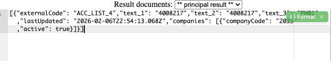
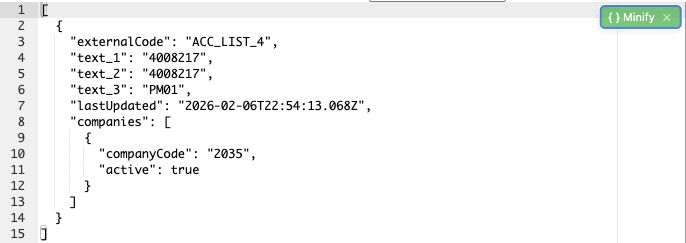
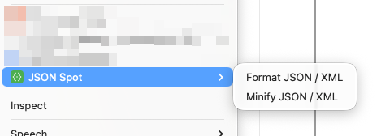
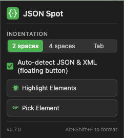

<p align="center">
  
</p>

<h1 align="center">JSON Spot</h1>

<p align="center">
  Format &amp; beautify JSON and XML directly inside textareas, code editors, and contenteditable elements on any webpage.
</p>

<p align="center">
  <a href="https://github.com/vbalko-claimate/json-spot-extension/releases"></a>
  <a href="LICENSE"></a>
  
  
</p>

---

Unlike JSON viewer extensions that only format raw API responses, **JSON Spot** works with JSON and XML embedded in page components — textareas, CodeMirror, Monaco Editor, Ace Editor, and contenteditable elements.

No copy-pasting to external tools. Just click, format, done.

<p align="center">
  
  &nbsp;&nbsp;
  
</p>

## Features

| Feature | Description |
|---------|-------------|
| **Auto-detect** | Floating button appears when JSON or XML is detected in a focused element |
| **Format & Minify** | One-click toggle between beautified and compact output |
| **Code editors** | Ace, CodeMirror 5/6, Monaco Editor — works natively via their APIs |
| **Element picker** | Inspector-like mode to click any element and format its content |
| **Syntax highlighting** | Picked elements get color-coded JSON/XML output |
| **Keyboard shortcut** | <kbd>Alt</kbd>+<kbd>Shift</kbd>+<kbd>F</kbd> to format instantly |
| **Context menu** | Right-click &rarr; JSON Spot &rarr; Format / Minify |
| **Dark mode** | Popup adapts to system theme |
| **Copy to clipboard** | One-click copy after formatting via picker |
| **Badge count** | Shows number of formattable elements on the page |

<p align="center">
  
  &nbsp;&nbsp;
  
</p>

## Installation

### Chrome Web Store

*Coming soon*

### Manual (Developer Mode)

1. Clone this repository:
   ```bash
   git clone https://github.com/vbalko-claimate/json-spot-extension.git
   ```
2. Open `chrome://extensions/` in Chrome
3. Enable **Developer mode** (top right toggle)
4. Click **Load unpacked** and select the cloned folder

## Usage

**Automatic** — Focus a textarea or code editor containing JSON/XML. A green floating button appears:

> `{ } Format` &rarr; click &rarr; `{ } Minify` &rarr; click &rarr; back to original

**Keyboard** — Press <kbd>Alt</kbd>+<kbd>Shift</kbd>+<kbd>F</kbd> while focused on an element with JSON/XML.

**Context menu** — Right-click on any input element &rarr; **JSON Spot** &rarr; **Format JSON / XML** or **Minify JSON / XML**.

**Picker** — Open the popup &rarr; **Pick Element** &rarr; click any `<pre>`, `<code>`, or `<div>` on the page containing JSON/XML.

## Supported Editors

| Editor | Version | Method |
|--------|---------|--------|
| Plain `<textarea>` | — | Direct value manipulation |
| `contenteditable` | — | Direct textContent manipulation |
| [Ace Editor](https://ace.c9.io/) | All | `editor.getValue()` / `setValue()` |
| [CodeMirror 5](https://codemirror.net/5/) | All | `cm.getValue()` / `setValue()` |
| [CodeMirror 6](https://codemirror.net/) | All | `view.state.doc` / `view.dispatch()` |
| [Monaco Editor](https://microsoft.github.io/monaco-editor/) | All | `editor.getValue()` / `setValue()` |

## Permissions

| Permission | Why |
|------------|-----|
| `contextMenus` | Adds Format/Minify to right-click menu |
| `activeTab` | Accesses the current tab when you use the extension |
| `storage` | Saves your indent and auto-detect preferences |

No host permissions. No data collection. No network requests. Everything runs locally in your browser.

## Privacy

JSON Spot does not collect, store, or transmit any data. See the full [privacy policy](store/privacy-policy.txt).

## Tech Stack

- Chrome Extension Manifest V3
- Content scripts in ISOLATED and MAIN worlds
- Shadow DOM (closed) for UI isolation
- `window.postMessage` bridge for cross-world editor communication
- Pure JavaScript — zero dependencies

## License

[MIT](LICENSE)
